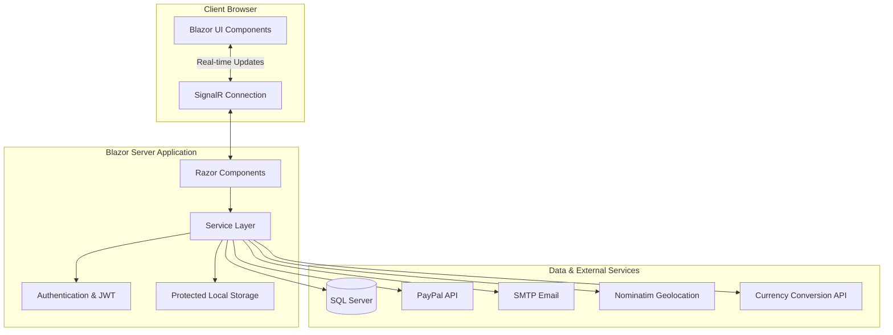
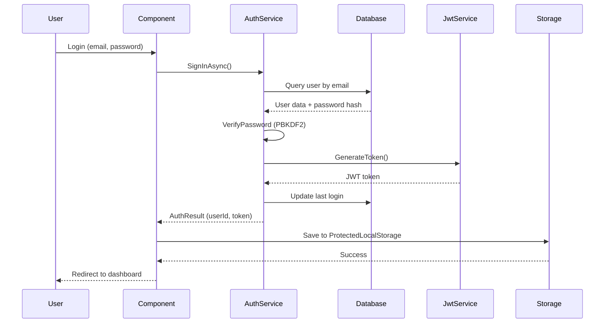

AndanDo is built on **Blazor Server**, a .NET framework that enables interactive web applications with C# instead of JavaScript. The architecture follows a layered, service-oriented design with clear separation of concerns.

## Architecture Overview

The system uses a **monolithic Blazor Server architecture** with the following key characteristics:

<CardGroup cols={2}>
  <Card title="Interactive Components" icon="cubes">
    Server-side rendering with real-time SignalR connection for UI updates
  </Card>
  <Card title="Service Layer" icon="gears">
    Dependency-injected services handling business logic and data access
  </Card>
  <Card title="SQL Server Database" icon="database">
    Stored procedures for data operations with ADO.NET
  </Card>
  <Card title="External Integrations" icon="plug">
    PayPal, email services, geolocation APIs, and currency conversion
  </Card>
</CardGroup>

## High-Level Architecture Diagram



## Architectural Layers

### 1. Presentation Layer

The presentation layer consists of **Razor Components** organized by feature area:

<Accordion title="Component Organization">
```
Components/
├── Pages/                    # Routable page components
│   ├── Home.razor           # Landing page with tour cards
│   ├── Marketplace.razor    # Tour marketplace listing
│   ├── SearchResults.razor  # Search results with filters
│   ├── TourDetails.razor    # Tour detail view
│   ├── Login_Account.razor  # Authentication
│   ├── Register_Account.razor
│   ├── Invoice.razor        # Invoice generation
│   ├── Dashboard/           # Creator dashboard pages
│   │   ├── MyBookings.razor
│   │   ├── Reports.razor
│   │   └── ...
│   ├── Administrator/       # Admin pages
│   └── FormsServices/       # Tour creation/editing
├── Layout/                  # Layout components
└── Shared/                  # Reusable components
    ├── NavMenu.razor
    ├── Searchbar.razor
    ├── Sliders.razor
    ├── ValidateLogin.razor
    └── ImageHelper.cs
```
</Accordion>

**Key characteristics:**
- Interactive Server render mode (`InteractiveServer`)
- Real-time UI updates via SignalR
- Component-based architecture with data binding
- Custom preloader with random loading messages

### 2. Service Layer

The service layer implements **dependency injection** with scoped services registered in `Program.cs`. Services are organized by domain:

<CodeGroup>
```csharp Program.cs - Service Registration
// Tour management
builder.Services.AddScoped<ITourService, TourService>();

// Authentication & security
builder.Services.AddScoped<IJwtTokenService, JwtTokenService>();
builder.Services.AddScoped<IAuthService, AuthService>();
builder.Services.AddScoped<IPasswordResetService, PasswordResetService>();
builder.Services.AddScoped<UserSession>();

// Email & notifications
builder.Services.AddScoped<IEmailService, EmailService>();
builder.Services.AddScoped<IMailService, MailService>();
builder.Services.AddSingleton<MailNotificationDispatcher>();

// External integrations
builder.Services.AddHttpClient<IPaypalService, PaypalService>();
builder.Services.AddScoped<ICurrencyConversionService, CurrencyConversionService>();

// Utility services
builder.Services.AddScoped<IPostLikeService, PostLikeService>();
builder.Services.AddScoped<IReviewService, ReviewService>();
builder.Services.AddScoped<IFormularioTipoService, FormularioTipoService>();
builder.Services.AddScoped<ISettingsService, SettingsService>();
```

```csharp AuthService.cs - Service Implementation Example
public sealed class AuthService : IAuthService
{
    private readonly string _connectionString;
    private readonly IJwtTokenService _jwtTokenService;
    private const int Pbkdf2Iterations = 100_000;

    public AuthService(IConfiguration configuration, IJwtTokenService jwtTokenService)
    {
        _connectionString = configuration.GetConnectionString("DefaultConnection")
            ?? throw new InvalidOperationException("No se encontro DefaultConnection");
        _jwtTokenService = jwtTokenService;
    }

    public async Task<AuthResult> SignInAsync(LoginRequest request, 
        CancellationToken cancellationToken = default)
    {
        await using var connection = new SqlConnection(_connectionString);
        await connection.OpenAsync(cancellationToken);
        
        // Query user, verify password, generate JWT
        // ...
    }
}
```
</CodeGroup>

<Note>
**Service Lifetimes:**
- **Scoped**: Most services (one instance per HTTP request/SignalR connection)
- **Singleton**: `MailNotificationDispatcher` (shared across application)
- **HttpClient**: Factory pattern for external API calls
</Note>

### 3. Data Access Layer

Data access is implemented using **ADO.NET with SQL Server** and stored procedures:

<Accordion title="Data Access Pattern Example">
```csharp TourService.cs - Stored Procedure Call
public async Task<List<TourDto>> GetToursAsync(CancellationToken cancellationToken = default)
{
    var tours = new List<TourDto>();
    
    await using var connection = new SqlConnection(_connectionString);
    await connection.OpenAsync(cancellationToken);
    
    await using var command = new SqlCommand("sp_Tours_GetAll", connection)
    {
        CommandType = CommandType.StoredProcedure
    };
    
    await using var reader = await command.ExecuteReaderAsync(cancellationToken);
    while (await reader.ReadAsync(cancellationToken))
    {
        tours.Add(MapTourFromReader(reader));
    }
    
    return tours;
}
```
</Accordion>

**Key characteristics:**
- Direct ADO.NET for performance
- Stored procedures for complex operations
- Parameterized queries to prevent SQL injection
- Async/await throughout

## Authentication & Security

### Authentication Flow

AndanDo implements a **JWT-based authentication** system with cookie storage:



### Security Features

<CardGroup cols={2}>
  <Card title="Password Hashing" icon="lock">
    PBKDF2 with 100,000 iterations, SHA256, 16-byte salt
  </Card>
  <Card title="JWT Tokens" icon="key">
    Configurable expiration (default 120 minutes)
  </Card>
  <Card title="Protected Storage" icon="shield">
    ProtectedLocalStorage for secure client-side data
  </Card>
  <Card title="Role-Based Access" icon="users">
    Role verification for admin and creator features
  </Card>
</CardGroup>

<CodeGroup>
```csharp AuthService.cs - Password Hashing
public string HashPassword(string password)
{
    var salt = RandomNumberGenerator.GetBytes(Pbkdf2SaltSize);
    var hash = Rfc2898DeriveBytes.Pbkdf2(
        password,
        salt,
        Pbkdf2Iterations,
        HashAlgorithmName.SHA256,
        Pbkdf2KeySize);
    
    return $"{Convert.ToBase64String(salt)}:{Convert.ToBase64String(hash)}";
}

public bool VerifyPassword(string password, string passwordHash)
{
    var parts = passwordHash.Split(':');
    if (parts.Length != 2) return false;
    
    var salt = Convert.FromBase64String(parts[0]);
    var storedHash = Convert.FromBase64String(parts[1]);
    
    var computed = Rfc2898DeriveBytes.Pbkdf2(
        password,
        salt,
        Pbkdf2Iterations,
        HashAlgorithmName.SHA256,
        Pbkdf2KeySize);
    
    return CryptographicOperations.FixedTimeEquals(storedHash, computed);
}
```

```csharp Program.cs - Authentication Setup
builder.Services.AddAuthentication(
    CookieAuthenticationDefaults.AuthenticationScheme)
    .AddCookie();

builder.Services.AddCascadingAuthenticationState();
builder.Services.AddScoped<ProtectedLocalStorage>();

// In middleware pipeline
app.UseAuthentication();
app.UseAuthorization();
```
</CodeGroup>

## External Integrations

AndanDo integrates with several external services:

### Payment Processing

<Accordion title="PayPal Integration">
- **Service**: `PaypalService` with HttpClient factory
- **Configuration**: Sandbox/production mode, client credentials
- **Implementation**: REST API integration for order creation and capture
- **Location**: `Services/Paypal/PaypalService.cs`
</Accordion>

### Email Notifications

<Accordion title="SMTP Email Service">
- **Library**: MailKit for SMTP
- **Features**: HTML emails, password reset, booking confirmations
- **Configuration**: SMTP host, port, TLS, credentials
- **Dispatcher**: Singleton `MailNotificationDispatcher` for queued sending
</Accordion>

### Geolocation

<Accordion title="Nominatim & Google Maps">
- **Search**: Nominatim API for address autocomplete
- **Maps**: Google Maps JavaScript API for tour locations
- **Features**: Geolocation with normalized search (removes accents/spaces)
</Accordion>

### Currency Conversion

<Accordion title="Currency Conversion Service">
- **Service**: `CurrencyConversionService` with HttpClient
- **Purpose**: Real-time exchange rates for international pricing
- **Location**: `Services/Utility/CurrencyConversionService.cs`
</Accordion>

## Middleware Pipeline

The ASP.NET Core middleware pipeline is configured in `Program.cs:47-67`:

```csharp Program.cs
var app = builder.Build();

// Error handling
if (!app.Environment.IsDevelopment())
{
    app.UseExceptionHandler("/Error", createScopeForErrors: true);
    app.UseHsts();
}

// Status code pages
app.UseStatusCodePagesWithReExecute("/not-found", 
    createScopeForStatusCodePages: true);

// Security & static files
app.UseHttpsRedirection();
app.UseStaticFiles();
app.UseAntiforgery();

// Authentication
app.UseAuthentication();
app.UseAuthorization();

// Blazor routing
app.MapStaticAssets();
app.MapRazorComponents<App>()
    .AddInteractiveServerRenderMode();

app.Run();
```

<Info>
The pipeline order is critical: authentication must come before authorization, and antiforgery must be enabled for Blazor Server to protect against CSRF attacks.
</Info>

## State Management

AndanDo uses multiple state management strategies:

<CardGroup cols={2}>
  <Card title="UserSession" icon="user">
    Scoped service storing current user data during the SignalR connection
  </Card>
  <Card title="ProtectedLocalStorage" icon="hard-drive">
    Encrypted browser storage for persisting JWT and session data
  </Card>
  <Card title="Component State" icon="layer-group">
    Local component state with `@bind` directives
  </Card>
  <Card title="Cascading Parameters" icon="share-nodes">
    `CascadingAuthenticationState` for auth state propagation
  </Card>
</CardGroup>

## Real-Time Communication

Blazor Server uses **SignalR** for real-time server-to-client communication:

- **Connection**: Persistent WebSocket or long-polling connection
- **Render Mode**: `InteractiveServer` on components
- **Reconnection**: Built-in reconnection UI with `<ReconnectModal />`
- **Preloader**: Custom loading screen during initial connection

<Tip>
Blazor Server's SignalR connection means the application state lives on the server. This reduces client-side complexity but requires careful consideration of server resources and connection handling.
</Tip>

## Performance Considerations

### Optimization Strategies

1. **Scoped Services**: One instance per connection reduces memory overhead
2. **Async/Await**: All I/O operations are asynchronous
3. **Stored Procedures**: Optimized database queries
4. **Static Assets**: Mapped with fingerprinting for cache efficiency
5. **Image Uploads**: Stored locally in `wwwroot/uploads/`

### Scalability Notes

<Warning>
Blazor Server maintains a SignalR connection per user. For high-traffic scenarios, consider:
- Sticky sessions for load balancing
- Azure SignalR Service for connection offloading
- Connection limits and timeout configuration
- Monitoring connection counts and memory usage
</Warning>

## Configuration Management

Configuration is managed through `appsettings.json` and environment-specific files:

```json appsettings.json
{
  "ConnectionStrings": {
    "DefaultConnection": "Server=...;Database=AndandoDB;..."
  },
  "Jwt": {
    "Issuer": "AndanDo",
    "Audience": "AndanDo",
    "SecretKey": "...",
    "ExpirationMinutes": 120
  },
  "Smtp": {
    "Host": "smtp.gmail.com",
    "Port": 587,
    "UseStartTls": true
  },
  "PayPal": {
    "Mode": "sandbox",
    "ClientId": "...",
    "BaseUrl": "https://api-m.sandbox.paypal.com"
  }
}
```

<Note>
Configuration sections are bound to strongly-typed options classes using `builder.Services.Configure<T>()` for type safety and IntelliSense support.
</Note>

## Next Steps

<CardGroup cols={2}>
  <Card title="Tech Stack" icon="layer-group" href="/development/tech-stack">
    Explore the technologies and NuGet packages used
  </Card>
  <Card title="Project Structure" icon="folder-tree" href="/development/project-structure">
    Deep dive into code organization and file structure
  </Card>
  <Card title="Database Schema" icon="database" href="/configuration/database">
    Learn about the SQL Server database design
  </Card>
  <Card title="API Integration" icon="plug" href="/api/tour-service">
    External API integration patterns
  </Card>
</CardGroup>