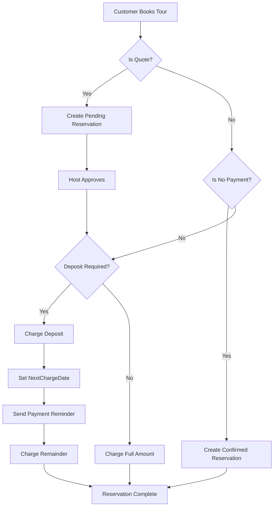

## Overview

AndanDo supports multiple pricing models beyond simple pay-in-full transactions. You can offer quotes (requiring approval), deposit-based bookings, and custom payment plans.

<Info>
  Advanced pricing features are stored in the `Tour` table and apply to all ticket types for that tour.
</Info>

## Pricing Models

<CardGroup cols={3}>
  <Card title="Standard Payment" icon="credit-card">
    Customer pays full amount at checkout.
    
    **Configuration:**
    - `IsQuote = false`
    - `IsNoPayment = false`
  </Card>

  <Card title="Quote System" icon="file-invoice">
    Requires host approval before payment.
    
    **Configuration:**
    - `IsQuote = true`
    - Optional: Set deposit percentage
  </Card>

  <Card title="No Payment" icon="hand-holding-dollar">
    Free tours or pay-on-arrival.
    
    **Configuration:**
    - `IsNoPayment = true`
  </Card>
</CardGroup>

## Pricing Configuration Fields

The `TourRegistrationRequest` includes these pricing fields:

```csharp
public record TourRegistrationRequest(
    // ... other fields
    bool IsQuote,                    // Requires approval before booking
    bool IsNoPayment,                // No online payment required
    decimal? QuoteDepositPercent,    // Deposit % (e.g., 0.25 = 25%)
    int? QuoteDueDays,               // Days until full payment due
    // ...
);
```

## Quote-Based Pricing

Quotes allow you to review bookings before accepting payment. Perfect for custom tours or high-value bookings.

### How Quote Pricing Works

<Steps>
  <Step title="Customer Requests Quote">
    Customer fills out booking form with travel details.
  </Step>

  <Step title="Host Reviews Request">
    You review the request in your dashboard and either:
    - Approve (customer receives payment link)
    - Reject (customer is notified)
    - Request more information
  </Step>

  <Step title="Customer Pays Deposit (Optional)">
    If `QuoteDepositPercent` is set, customer pays deposit to secure booking.
  </Step>

  <Step title="Remainder Due Later">
    If using deposits, remainder is due `QuoteDueDays` before travel date.
  </Step>
</Steps>

### Configuring Quote Pricing

```csharp
var quoteTour = new TourRegistrationRequest(
    // ... basic fields
    IsQuote: true,
    IsNoPayment: false,
    QuoteDepositPercent: 0.30m,     // 30% deposit required
    QuoteDueDays: 14,                // Full payment 14 days before tour
    // ...
);
```

**Customer experience:**
1. Requests booking for $500 tour
2. Receives quote approval email
3. Pays $150 deposit (30%)
4. Remainder $350 due 14 days before travel

<Accordion title="Quote Approval Workflow">
  When `IsQuote = true`, bookings create a reservation with:
  - `ReservationStatus = 0` (Pending approval)
  - `PaymentStatus = 0` (Unpaid)
  
  Host actions available:
  - **Approve:** Changes `ReservationStatus = 1`, sends payment link
  - **Reject:** Changes `ReservationStatus = 4`, refunds any deposit
  - **Request Info:** Sends email to customer for clarification
</Accordion>

## Deposit-Based Bookings

Charge a percentage upfront and collect the remainder later.

### Deposit Configuration

<CardGroup cols={2}>
  <Card title="Deposit Percentage" icon="percent">
    Portion paid at booking.
    
    ```csharp
    QuoteDepositPercent = 0.25m  // 25% upfront
    ```
    
    **Range:** 0.01 - 1.00 (1% - 100%)
  </Card>

  <Card title="Due Days" icon="calendar-days">
    Days before tour for remainder.
    
    ```csharp
    QuoteDueDays = 7  // Pay 7 days before
    ```
    
    **Typical values:** 7, 14, 30
  </Card>
</CardGroup>

### Deposit Calculation Example

```csharp
public class DepositCalculator
{
    public decimal CalculateDeposit(decimal totalAmount, decimal depositPercent)
    {
        return Math.Round(totalAmount * depositPercent, 2);
    }
    
    public decimal CalculateRemainder(decimal totalAmount, decimal depositPaid)
    {
        return totalAmount - depositPaid;
    }
    
    public DateTime CalculateDueDate(DateTime travelDate, int dueDays)
    {
        return travelDate.AddDays(-dueDays);
    }
}

// Example usage
var calculator = new DepositCalculator();
var tourPrice = 500.00m;
var depositPercent = 0.30m;
var travelDate = new DateTime(2026, 06, 15);

var depositAmount = calculator.CalculateDeposit(tourPrice, depositPercent);
// Result: $150.00

var remainder = calculator.CalculateRemainder(tourPrice, depositAmount);
// Result: $350.00

var dueDate = calculator.CalculateDueDate(travelDate, 14);
// Result: June 1, 2026
```

<Warning>
  Ensure your cancellation policy accounts for non-refundable deposits. Clearly communicate this to customers at checkout.
</Warning>

## Payment Plans

Reservations track payment status using these fields:

```csharp
public sealed record TourReservationRequest(
    // ... booking fields
    byte PaymentStatus,         // 0=Unpaid, 1=Paid, 2=Partial, 3=Refunded, 4=Cancelled
    byte PaymentPlanType,       // 0=Full, 1=Deposit, 2=Split, 3=Custom
    decimal? DepositPercent,    // Deposit percentage paid
    decimal? AmountPaid,        // Amount paid so far
    decimal? AmountPending,     // Amount still owed
    DateTime? NextChargeDate,   // When next payment is due
    // ...
);
```

### Payment Status Values

| Status | Value | Description |
|--------|-------|-------------|
| Unpaid | 0 | No payment received |
| Paid | 1 | Fully paid |
| Partial | 2 | Deposit paid, remainder pending |
| Refunded | 3 | Payment returned to customer |
| Cancelled | 4 | Booking cancelled |

### Payment Plan Types

| Type | Value | Description |
|------|-------|-------------|
| Full Payment | 0 | Pay entire amount at once |
| Deposit Plan | 1 | Deposit now, remainder later |
| Split Payment | 2 | Multiple installments |
| Custom Plan | 3 | Negotiated payment schedule |

## Updating Payment Status

The `UpdateReservationPaymentStatusAsync` method tracks payment changes:

```csharp
public async Task UpdateReservationPaymentStatusAsync(
    int reservationId,
    byte paymentStatus,
    string? paymentProvider,
    string? paymentReference,
    CancellationToken cancellationToken = default)
{
    if (reservationId <= 0)
    {
        throw new ArgumentException("Invalid ReservationId.", nameof(reservationId));
    }

    await using var connection = CreateConnection();
    await connection.OpenAsync(cancellationToken);

    var reservationTable = await ResolveReservationTableAsync(connection, cancellationToken);
    if (string.IsNullOrWhiteSpace(reservationTable))
    {
        throw new InvalidOperationException("Reservation table not found.");
    }

    var sql = $@"
UPDATE {reservationTable}
SET PaymentStatus = @PaymentStatus,
    PaymentProvider = @PaymentProvider,
    PaymentReference = @PaymentReference,
    UpdatedAt = SYSUTCDATETIME()
WHERE TourReservationId = @ReservationId;";

    await using var cmd = new SqlCommand(sql, connection);
    cmd.Parameters.Add(new SqlParameter("@PaymentStatus", SqlDbType.TinyInt) { Value = paymentStatus });
    cmd.Parameters.AddWithValue("@PaymentProvider", (object?)paymentProvider ?? DBNull.Value);
    cmd.Parameters.AddWithValue("@PaymentReference", (object?)paymentReference ?? DBNull.Value);
    cmd.Parameters.Add(new SqlParameter("@ReservationId", SqlDbType.Int) { Value = reservationId });

    var rows = await cmd.ExecuteNonQueryAsync(cancellationToken);
    if (rows == 0)
    {
        throw new InvalidOperationException("Reservation not found for update.");
    }
}
```

<Info>
  Payment updates are typically triggered by webhook notifications from your payment provider (Stripe, Azul, CardNet, etc.).
</Info>

## No-Payment Tours

For free tours or pay-on-arrival scenarios:

```csharp
var freeTour = new TourRegistrationRequest(
    // ... basic fields
    IsQuote: false,
    IsNoPayment: true,      // No online payment
    QuoteDepositPercent: null,
    QuoteDueDays: null,
    // ...
);
```

**Use cases:**
- Free walking tours (tips appreciated)
- Pay-at-venue experiences
- Reservation-only system (no payment)
- Scholarship/complimentary bookings

<Warning>
  No-payment tours still create reservations but skip payment processing entirely. Ensure your cancellation policy addresses no-shows.
</Warning>

## Dynamic Pricing (Future Feature)

While not yet implemented, AndanDo's architecture supports future dynamic pricing:

- **Seasonal pricing:** Higher rates during peak season
- **Demand-based:** Prices increase as capacity fills
- **Early bird discounts:** Lower prices for advance bookings
- **Last-minute deals:** Reduced prices for unsold inventory

<Tip>
  Currently, implement time-based pricing using multiple ticket types with different `VentaInicioUtc` and `VentaFinUtc` windows.
</Tip>

## Currency Handling

All pricing supports multiple currencies:

```csharp
CurrencyCode = "USD"  // or "DOP", "EUR"
```

### Currency Conversion Service

AndanDo includes a currency conversion service for displaying prices:

```csharp
public interface ICurrencyConversionService
{
    Task<decimal> ConvertAsync(
        decimal amount, 
        string fromCurrency, 
        string toCurrency,
        CancellationToken cancellationToken = default);
}
```

**Example usage:**
```csharp
@inject ICurrencyConversionService CurrencyService

var priceUSD = 100m;
var priceDOP = await CurrencyService.ConvertAsync(priceUSD, "USD", "DOP");
// Result: ~5,600 DOP (depending on exchange rate)
```

## Dashboard Price Display

The dashboard shows pricing information across tours:

```csharp
private static decimal? GetMainPrice(TourMarketplaceItemDto tour)
{
    // Try FromPrice first (if set)
    if (tour.FromPrice.HasValue) return tour.FromPrice.Value;
    
    // Fall back to MaxPrice
    if (tour.MaxPrice.HasValue) return tour.MaxPrice.Value;

    // Last resort: first ticket type price
    var ticketPrice = tour.TicketTypes.FirstOrDefault()?.Price;
    return ticketPrice;
}

private static string GetCurrency(TourMarketplaceItemDto tour)
{
    return tour.TicketTypes.FirstOrDefault()?.CurrencyCode ?? "DOP";
}

private static string FormatCurrency(decimal amount, string currencyCode)
{
    var symbol = currencyCode switch
    {
        "USD" => "$",
        "EUR" => "EUR",
        _ => "RD$"
    };

    return $"{symbol}{amount:N0}";
}
```

## Best Practices

<AccordionGroup>
  <Accordion title="Quote Pricing">
    - Use for tours over $500 per person
    - Respond to quotes within 24 hours
    - Set clear approval criteria (group size, dates, special requests)
    - Provide alternative options if rejecting
    - Use auto-approval for standard requests
  </Accordion>

  <Accordion title="Deposit Strategy">
    - Charge 25-50% deposits for high-value tours
    - Set due date at least 7 days before travel (for refunds/cancellations)
    - Send automatic payment reminders 3, 7, and 14 days before due date
    - Clearly state deposit is non-refundable after X days
    - Offer flexible rescheduling if deposit is paid
  </Accordion>

  <Accordion title="Pricing Psychology">
    - Use charm pricing: $99 instead of $100
    - Show original price with discount: ~~$150~~ $120
    - Bundle extras for perceived value
    - Anchor with a premium option first
    - Display "per person" vs "per group" strategically
  </Accordion>

  <Accordion title="Cancellation Policies">
    - Full refund: More than 14 days before travel
    - 50% refund: 7-14 days before
    - No refund: Less than 7 days or no-show
    - Deposit always non-refundable
    - Offer credit/reschedule as alternative
  </Accordion>
</AccordionGroup>

## Reservation Data Flow

Here's how pricing affects the reservation lifecycle:



## Next Steps

<CardGroup cols={2}>
  <Card title="Booking Management" icon="calendar-check" href="/hosts/managing-bookings">
    View and manage customer reservations
  </Card>

  <Card title="Dashboard Analytics" icon="chart-line" href="/hosts/dashboard">
    Track revenue and conversion metrics
  </Card>

  <Card title="Payment Integration" icon="credit-card" href="/api/payment-service">
    Configure payment provider webhooks
  </Card>
  
  <Card title="Cancellation Policies" icon="ban" href="/hosts/pricing">
    Set up cancellation and refund rules
  </Card>
</CardGroup>